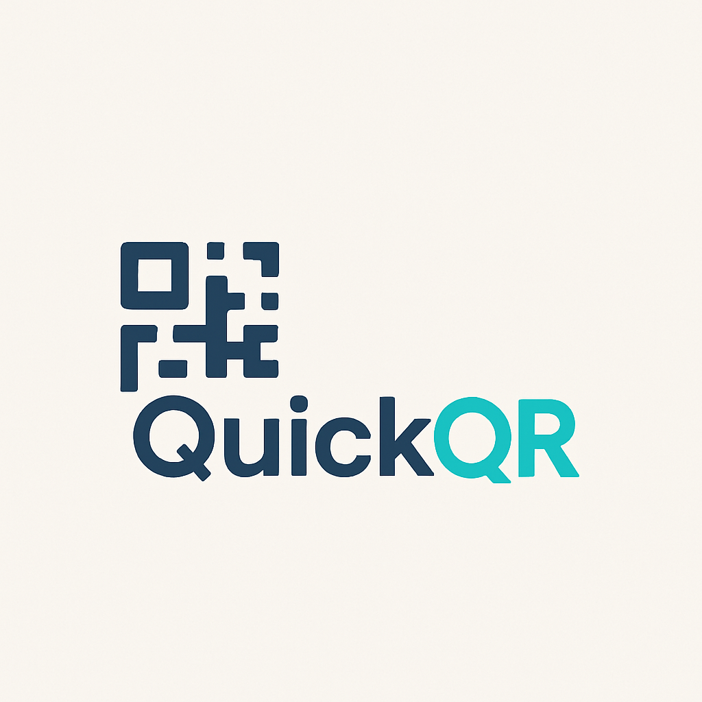
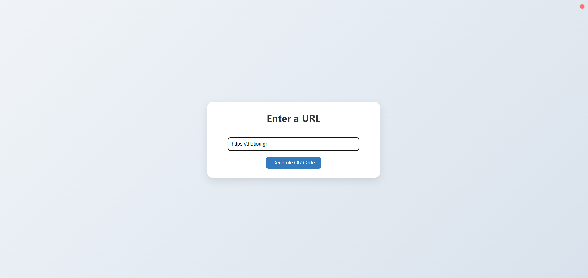
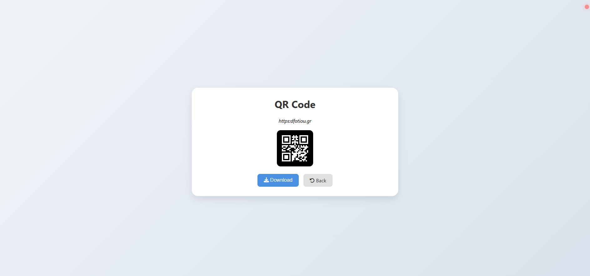
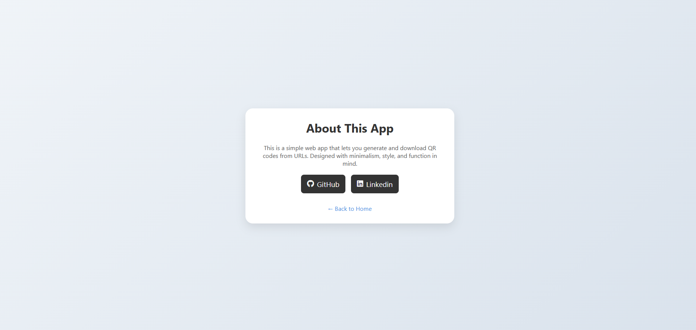

<div align="center">

  
  <h1>QuickQR</h1>

  <p>
    Instant, sleek, scannable – your QR codes, simplified.! 
  </p>


<!-- Badges -->
[](https://github.com/fotioudim/quick-qr/commits/main)
[](https://github.com/fotioudim/quick-qr/issues/)
[](https://github.com/fotioudim/quick-qr/network/members)
[](https://github.com/fotioudim/quick-qr/stargazers)
[](https://opensource.org/licenses/MIT)


<h4>
    <a href="https://github.com/fotioudim/quick-qr/issues/">Report Bug</a>
  <span> · </span>
    <a href="https://github.com/fotioudim/quick-qr/issues/">Request Feature</a>
  </h4>
</div>

<br />

<!-- Table of Contents -->
# :notebook_with_decorative_cover: Table of Contents

- [:notebook\_with\_decorative\_cover: Table of Contents](#notebook_with_decorative_cover-table-of-contents)
    - [:star2: About the Project](#star2-about-the-project)
        - [:books: Tech Stack](#books-tech-stack)
        - [:notebook: Documentation](#notebook-documentation)
    - [:toolbox: Getting Started](#toolbox-getting-started)
        - [:wrench: Prerequisites](#wrench-prerequisites)
        - [:running: Run Locally](#running-run-locally)
    - [:bookmark\_tabs: Usage](#bookmark_tabs-usage)
    - [:warning: License](#warning-license)
    - [:handshake: Contact](#handshake-contact)

<!-- About the Project -->
## :star2: About the Project

QuickQR is a lightweight, modern web application that instantly generates QR codes through 
both a clean web interface and a flexible REST API. Built with Quarkus, Kotlin, and Gradle (Kotlin DSL), 
the app emphasizes speed and simplicity. The frontend is rendered using the Qute templating engine, 
offering a polished HTML interface, while the REST API supports seamless integration with other services.

Whether you're sharing links, contact details, or custom text, QuickQR offers a seamless experience with clean design 
and developer-friendly architecture. 

<!-- TechStack -->
### :books: Tech Stack

The tech stack of this project consists of the following main technologies/frameworks/tools:
- [](https://quarkus.io/)
- [](https://kotlinlang.org/)
- [](https://gradle.org/)

<!-- Documentation -->
### :notebook: Documentation

Based on https://www.nayuki.io/page/qr-code-generator-library
and inspired by https://myfear.substack.com/p/how-to-generate-qr-codes-in-quarkus

Useful documentation for Quarkus-Kotlin-Gradle with Kotlin DSL stack:
- [Quarkus integration with Kotlin](https://quarkus.io/guides/kotlin)
- [Quarkus integration with Gradle & Kotlin DSL](https://quarkus.io/guides/gradle-tooling)
- [Kotlin integration with Rest Assured testing library](https://github.com/rest-assured/rest-assured/wiki/Kotlin)

<!-- Getting Started -->
## 	:toolbox: Getting Started

<!-- Prerequisites -->
### :wrench: Prerequisites

Java 21

<!-- Run Locally -->
### :running: Run Locally
```
./gradlew quarkusDev 
```

<!-- Usage -->
## :bookmark_tabs: Usage

Access the web page in your browser by entering the url 
```
http://localhost:8080/qr-page
```
* **Home page**: enter text and press Enter or click the button

* **QR code page**: Press the "Download" button to receive the QR code in jpg file format

* **About page**: accessible by clicking the blinking red light in upper right corner


or perform a request in the exposed REST endpoint using the following sample
in order to receive the QR code in SVG file format:
```
curl --request GET --url 'http://localhost:8080/qr/download/svg?text=sample-text'
```

<!-- License -->
## :warning: License

Distributed under the MIT License. See [LICENSE.md](./LICENSE.md) for more information.


<!-- Contact -->
## :handshake: Contact

You can reach me at:
- Personal website: https://www.dfotiou.gr
- StackOverflow profile: https://stackoverflow.com/users/11680294/fotiou-d
- Linkedin profile: https://www.linkedin.com/in/dimitris-fotiou/
- Email: [dfotiou.tech@gmail.com](mailto:dfotiou.tech@gmail.com)